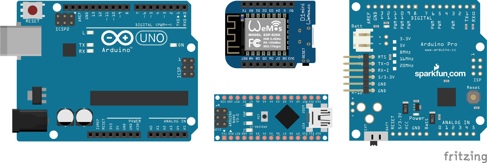

<link rel="stylesheet" href="assets/css/custom.css?v=2">

<div class="nav-container">
  <a href="Sicherheit" class="button">Zurück</a>
  <a href="Grundlagen2" class="button">Weiter</a>
</div>

## Grundlagen 1 - Den Arduino kennenlernen

Wie ihr wisst, wollen wir heute mit Arduinos arbeiten. Aber was ist das überhaupt? Ein Arduino ist ein Mikrocontroller, also im Prinzip ein kleiner Computer, der auf ein bestimmte Aufgabe spezialisiert ist. Man kann sie selber programmieren, damit sie genau das machen was Du möchtest.

<div class="schaltplan-box">
  
</div>


### Aufbau des Arduinos
#### Pins
Aber wie arbeitet man mit einem Arduino. Am wichtigsten für die Kommunikation mit dem Arduino sind die verschiedenen Anschlüsse oder **Pins**.
Dabei gibt es verschiedene Arten. Für uns wichtig sind erstmal nur die Pins für die **Stromversorgung**, sowie **digitale** und **analoge Pins**.

Bei den Pins für die **Stromversorgung** handelt es sich im Prinzip um Plus und Minuspole an denen der Arduino eine Betriebsspannung erzeugen kann, wenn er an einen Computer oder Laptop angeschlossen ist. Dadurch brauchen wir also keine äußere Spannungsquelle wenn wir beispielsweise eine LED anschließen wollen. Ihr könnt einfach die **5V oder 3.3V Pins (Pluspole)** bzw **GND Pins (Minuspole)** des Arduinos dafür benutzen. 

Weiterhin gibt es die **digitalen und analogen Pins**. Das sind im Prinzip alles Pins die wir benutzen können um Signale von außen an den Arduino weiterzuleiten oder Signale vom Arduino selbst an andere Bauteile auszusenden. Beim Arduino sind diese Signale einfach verschieden hohe Spannungen, die vom Arduino und anderen Beispielen entsprechend interpretiert werden.

Man kann die Pins also als **Input** für den Arduino oder **Output** aus dem Arduino heraus benutzen. Ein Beispiel wäre ein Temperatursensor. Dieser misst die Temperatur und gibt ein Signal zurück, das die Informationen für die Temperatur enthält. Dieses Signal kann dann an einen Input Pin des Arduinos weitergeleitet werden. Dieser erhält dann die Infos von dem Temperatursensor und kann damit arbeiten. Von den Output Pins aus kann der Arduino dann selbst Signale an ein anderes Bauteil weiterleiten. Zum Beispiel kann er einem Display signalisieren, was dieser anzeigen soll.

Aber was ist nun der Unterschied zwischen analogen und digitalen Pins? Der liegt einfach darin, was für Signale die Pins empfangen und weiterleiten können. **Digitale Pins** senden nur digitale Signale. Das heißt, dass diese Signale **nur bestimmte Zustände annehmen können**: bei uns sind das **HIGH** und **LOW**. Dabei entspricht **HIGH** einer **hohen Spannung** an diesem Pin und **LOW** einer **niedrigen Spannung**. Ihr könnt euch HIGH als ein "an" und LOW als ein "aus" vorstellen.

**Analoge** Pins können nur analoge Signale empfangen oder weiterleiten. Analoge Signale sind im Gegensatz zu digitalen **kontinuierlich**. Sie können bei uns also **alle möglichen Werte in einem bestimmten Wertebereich annehmen**. 

<div class="aufgabe">
<h3>🛠️ Aufgabe</h3>
<ol>
  <li>Schau dir den Arduino an und finde alle erwähnten Arten von Pins</li>
</ol>
</div>


### Die Arduino IDE
Wie schon erwähnt können wir digitale und analoge Pins sowohl als Input als auch als Output benutzen. Wofür ein Pin genau benutzt wird ist erstmal nicht klar festgelegt, das können wir aber durch Programmieren der Arduinos festlegen.

Dafür schauen wir uns jetzt mal an wie wir das machen. Genauer schauen wir uns jetzt die **Arduino IDE** an. IDE ist kurz für Integrated Development Environment und ist einfach nur ein Programm in dem wir unseren Code schreiben können und das uns hilft diesen dann auf die Arduinos hochzuladen. 

<div class="aufgabe">
<h3>🛠️ Aufgabe</h3>
<ol>
  <li>Lies dir genau die Infos durch</li>
  <li>Finde parallel die erwähnten Funktionen in der Arduino IDE</li>
</ol>
</div>

Wenn ihr die Arduino IDE öffnet seht ihr direkt einen sogenannten neuen **Sketch**. Das ist einfach eine vorbereitete fast leere Datei in den ihr euren Code schreiben werdet

Wenn du einen neuen Sketch öffnest siehst du direkt einige Zeilen Code. Dies ist die allgemeine Struktur für einen Arduino Sketch.

```cpp
void setup() {
    //Setup Code, der einmal ausgeführt wird
}

void loop() {
    //Hauptteil des Codes, der wiederholt ausgeführt wird
}
```

Was du hier siehst sind zwei **Funktionen**, Codeblöcke die einen Namen haben und von einem Programm aufgerufen werden können. In den **geschweiften Klammern { }** steht was diese Funktionen tun, also der Code der abgearbeitet wird, wenn sie aufgerufen werden. 


Die **Setup Funktion** wird automatisch **einmal zu Beginn des Programms** aufgerufen, also direkt sobald du deinen Code auf den Arduino geladen hast. Hier kannst du also einmalig bestimmte Werte im Vornherein festlegen. Etwa ob deine Pins als In- oder Output funktionieren etc. Diese Funktion **wird nur einmal aufgerufen**.

Die **Loop Funktion** ist, so wie es der Name sagt eine Schleife, der Code den man in diese Funktion schreibt wird also **immer wieder, endlos oft ausgeführt**. Sie stellt den Hauptteil deines Programms dar. Hier drin kannst du zum Beispiel wenn du einen Temperatursensor an deinen Arduino anschließen willst, bei jeder der Wiederholungen der Schleife einmal den Wert lesen, den der Sensor dir gibt und ihn dir anzeigen lassen.

Für unser Projekt wirst du dich eigentlich nur in diesen beiden Funktionen wiederfinden. Man kann weitere schreiben, das ist aber für unsere Zwecke nicht notwendig.

#### Verbindung mit dem Arduino

Bevor wir irgendetwas auf den Arduino hochladen können müssen wir diesen aber zuerst einmal **mit der IDE verbinden**, damit sie weiß um was für einen Mikrocontroller es sich handelt etc. Dafür könnt ihr oben auf der **dunkelgrünen Leiste** einmal auf das **Auswahlfeld neben dem USB Zeichen** klicken und dann unter **Boards** nach **Arduino Uno** suchen und diesen auswählen.

Ein offener Sketch sollte so aussehen

<div class="aufgabe">
<h3>🛠️ Aufgabe</h3>
<ol>
  <li>Verbinde deinen Arduino Uno mit der Arduino IDE</li>
</ol>
</div>

Neben dieser Auswahlleiste sind auch drei andere Knöpfe. Der **Haken** kompiliert euren Code einmal. Das heißt, dass er ihn **für den Computer und den Arduino verständlich macht**. Und checkt außerdem, ob ihr irgendwelche syntaktischen Fehler in eurem Code gemacht habt. z.B ein Semikolon vergessen. Ob der Code auch so funktioniert wie ihr möchtet kann dabei nur begrenzt getestet werden.
Der **Pfeil nach rechts** **lädt euer Programm auf den Arduino**, wobei der Code auch nochmal **kompiliert** wird. Der Arduino führt sobald der Code hochgeladen wurde **einmal die Setup Funktion** durch und **danach immer wieder die Loop Funktion**.

Der Letzte Knopf mit dem **Dreieck und dem kleinen Käfer** ist für **Debugging**. Also um deinen Code auf Fehler zu testen. Damit werden wir uns hier aber noch nicht auseinandersetzen weil wir nicht so komplizierte Dinge machen 


### Grundlegende Funktionen der Arduino IDE und Programmiersyntax

Jetzt wollen wir Euch ein paar **wichtige Grundfunktionen der Arduino IDE** näherbringen. Dafür müssen wir aber kurz einige Programmiergrundlagen einführen. Nämlich **Variablen** sowie **Funktionen**.

#### Variablen

**Variablen** sind wie Ihr sie auch aus Mathe kennt ein Platzhalter für alle möglichen Werte eines bestimmten Wertebereichs. Beim Programmieren könnt Ihr sie euch als **Objekt eines bestimmten Typs** vorstellen indem Ihr zu diesem **passende Werte speichern** könnt. Mit Variablen könnt Ihr dann weiterrechnen wie Ihr es mit dem Wert, den Ihr darin gespeichert habt machen würdet und seinen **Wert auch im Laufe eures Programms verändern**. 
Den **Typ bzw. Datentyp** den eine Variable haben kann speichert bestimmt **welche Art von Wert man in ihr speichern kann**. Also zum Beispiel eine ganze Zahl, eine Kommazahl, einen einzelnen Buchstaben etc.

Die verschiedenen **Datentypen** mit denen wir arbeiten werden sind erstmal hauptsächlich **Integer** (ganze Zahlen) und **Floats** (Kommazahlen).

In **C++**, also der Programmiersprache, die wir heute nutzen werden, erstellt man Variablen wie folgt:

```cpp
int ganze_Zahl;
float kommazahl;
```
Wenn man die Variable das **erste Mal erstellt** muss man **vor den Namen, den man ihr gibt den Datentyp schreiben**, den sie haben soll, damit der Computer richtig mit ihr umgeht. **Werte kann man ihnen einfach mit einem "=" zuweisen**. Ist die Variable schon vorher erstellt worden muss der Datentyp auch nicht mehr davor geschrieben werden.

```cpp
ganze_Zahl = 3;
float kommazahl = 1.7;
```

Natürlich kann man einer Variablen auch **direkt, wenn man sie erstellt einen Wert zuweisen**.

```cpp
int ganze_Zahl = 8;
float kommazahl = 2.7;
```

> 💡 **Hinweise:**
> - *Das Semikolon ";" zeigt das Ende einer Zeile an und sollte nicht vergessen werden.*

#### Funktionen

**Funktionen** kennt ihr schon von **Setup und Loop**. Im Allgemeinen kann eine Funktion aber alles mögliche sein. Es handelt sich lediglich um einen Code-Schnipsel, der über seinen Namen **im Programm aufgerufen werden kann und dann ausgeführt wird**. Oft gibt man einer Funktion gewisse **Werte, mit denen sie arbeiten soll**. Und in den meisten Fällen **erhält man einen Wert als Rückgabe** oder Ergebnis der Funktion. Ein regulärer Funktionsaufruf einer Funktion "beispiel" sähe also zum Beispiel so aus

```cpp
int variable = beispiel(parameter_a, parameter_b);
```

Hier würde eine Funktion **"beispiel"** mit den Parametern **parameter_a** und **parameter_b** aufgerufen werden. Diese nutzt dann die ihr übergebenen Parameter und berechnet zum Beispiel irgendeinen neuen Wert. Dieser **Wert kann in einer neuen Variablen gespeichert werden**, hier in "variable":

#### pinMode
Wir haben ja schon Pins besprochen und dass man diese als Input oder Output festlegen muss. Das kann man jetzt in der IDE machen! Ob ein Pin Input oder Output ist legt man nur einmal fest. Das kommt also **in die Setup Funktion**. Zum Festlegen von Input und Output gibt es bereits eine vorgefertigte Funktion **"pinMode"**. Dieser gibt man als Argumente einfach die Nummer von dem Pin, den man benutzen möchte und ob es INPUT der OUTPUT ist.

Also beispielsweise so:

```cpp
pinMode(10, INPUT);
```


#### Read- und Write Funktionen

Und wie kann man über diesen Pin jetzt Signale empfangen oder senden? Dafür gibt es weitere vorgefertigte Funktionen. Nämlich die **Read- und Write Funktionen**. Dabei gibt es jeweils eine für digitale Pins und analoge Pins.

#### DigitalRead()

**DigitalRead** kann für einen **digitalen INPUT Pin** aufgerufen werden und erkennt ob das Signal, das dieser sendet gerade HIGH oder LOW ist. Diesen Wert kannst und solltest du direkt in einer Variablen speichern, um dann damit weiter zu arbeiten

```cpp
int gelesener_Wert = digitalRead(input_pin);
```

#### DigitalWrite()

**DigitalWrite** kann für einen **digitalen OUTPUT Pin** aufgerufen werden und legt fest, ob an diesem Pin jetzt das Signal **HIGH oder LOW** gesendet werden soll

```cpp
digitalWrite(output_pin, wert) // "wert" kann HIGH oder LOW sein
```


#### AnalogRead()

**AnalogRead** ist das Äquivalent von DigitalRead aber für **analoge INPUT Pins**, mit AnalogRead kann gelesen werden was gerade für eine Spannung an dem analogen INPUT Pin anliegt. Dieser Wert sollte direkt als Variable gespeichert werden. Dabei ist wichtig, dass AnalogRead einen Wert zwischen 0 und 1023 ausgibt, der repräsentiert was für ein Signal, bzw. was für eine Spannung am analogen Pin anliegt. 

```cpp
int gelesener_Wert = analogRead(input_pin);
```


#### AnalogWrite()

**AnalogWrite** ist das **analoge Äquivalent für digitalWrite**. Hier kannst du einen **Wert zwischen 0 und 255** an einen **analogen OUTPUT Pin** anlegen. (Dies legt dann fest was für eine Spannung, zwischen 0V und Betriebsspannung, an diesem anliegen soll.)

```cpp
analogWrite(output_pin, wert) // "wert" kann zwischen 0 und 255 liegen
```


#### delay()

Auch praktisch ist die **delay Funktion**. Diese sorgt dafür, dass das gesamte Programm eine gewisse Zeit anhält. Hier kann man in den Klammern als Parameter einfach angeben, wie lange das Programm warten soll, bis es weiterläuft. Die Zeit gibt man dabei in Millisekunden an. Ein Delay von einer Sekunde sähe also zum Beispiel so aus.

```cpp
delay(1000);
```


#### Kommentare

Wenn ihr für bessere Verständlichkeit kleine Notizen zu eurem Code machen möchtet könnt ihr einfach Kommentare direkt in den Quellcode schreiben. <code>//</code> am Beginn einer Zeile signalisieren dabei einen Kommentar und sorgen dafür, dass diese Zeile einfach vom Computer ignoriert wird.


<p class="spacing-1">&nbsp;</p>

---

<div class="nav-container">
  <a href="Sicherheit" class="button">Zurück</a>
  <a href="Grundlagen2" class="button">Weiter</a>
</div>
