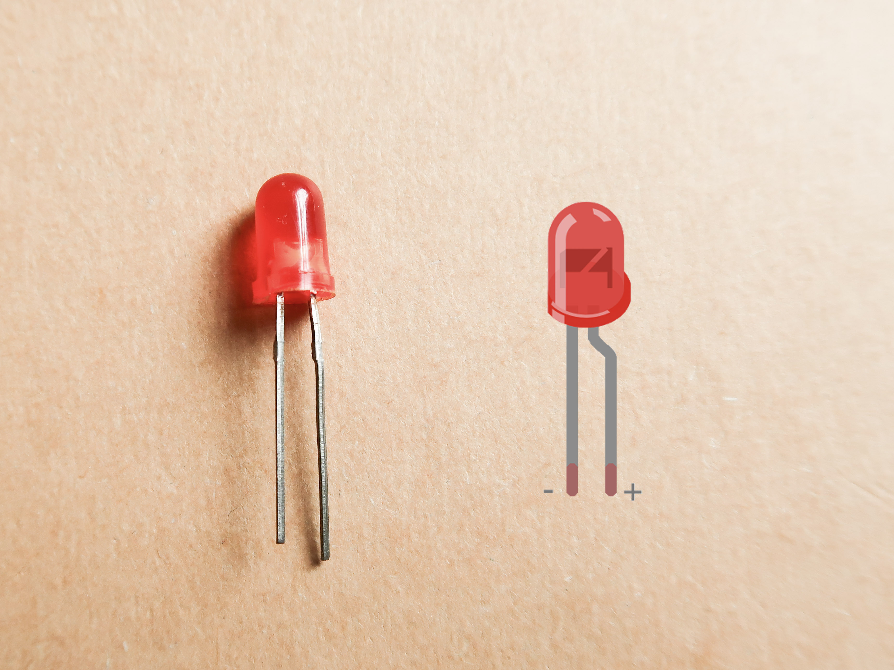
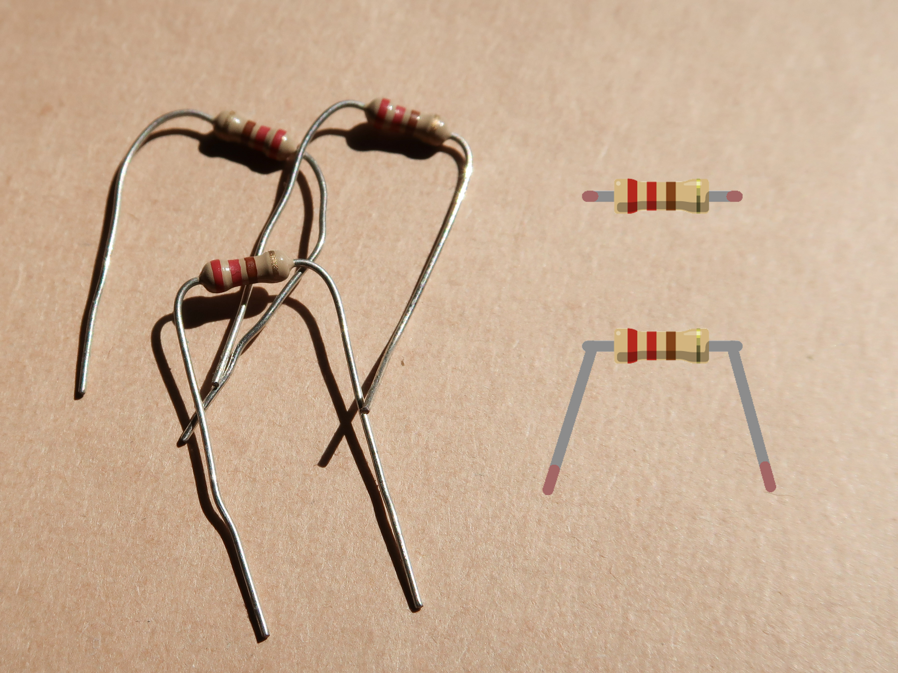
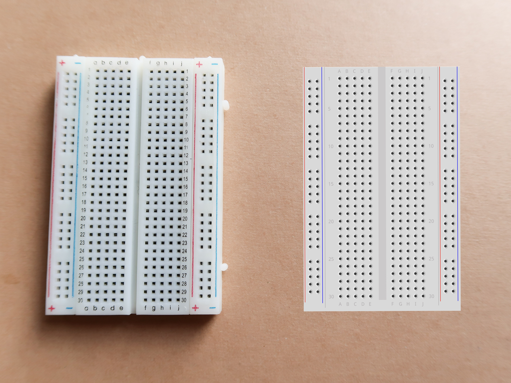
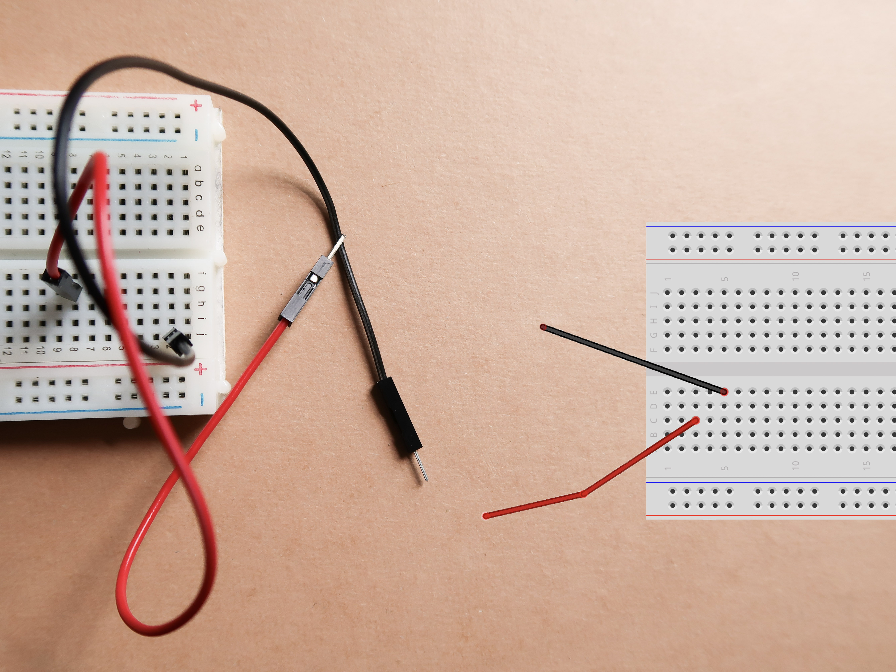
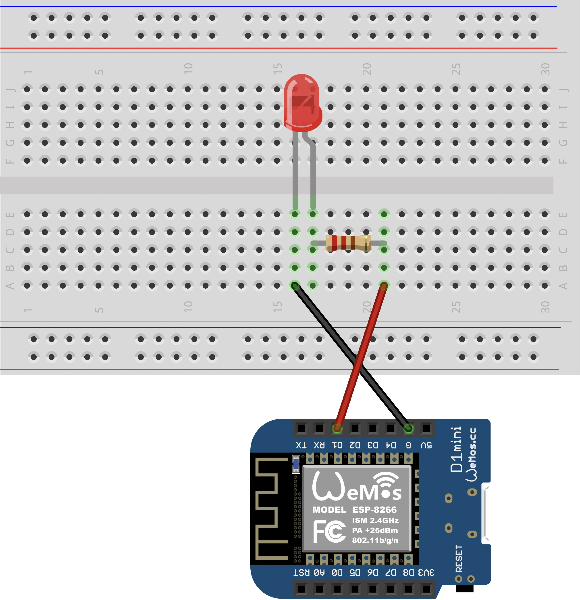

<link rel="stylesheet" href="assets/css/custom.css?v=2">

  <a href="Grundlagen1" class="button">Zurück</a>
  <a href="Grundlagen3" class="button">Weiter</a>

## Grundlagen 2 – LED anschließen 💡

**In diesem Kapitel lernst du, wie du eine LED richtig anschließt und sie mit dem Arduino blinken lässt.**

**LED** bedeutet *Light Emitting Diode*. LEDs können Licht produzieren, wenn man einen Strom an sie anlegt. Dabei ist es jedoch wichtig, in welche Richtung man sie anschließt. Den Pluspol schließt man bei einer LED immer an das lange Beinchen, den Minuspol immer an das kürzere.

ℹ️ Mehr Infos

LEDs bestehen aus einem speziellen Halbleitermaterial, das Strom nur in eine Richtung durchlässt. Fließt der Strom in dieser Richtung, regt er Elektronen an. Dabei wird Energie in Form von Licht frei. Deshalb muss man beim Anschließen auf die Polung achten: Das lange Bein ist der Pluspol (Anode), das kurze Bein der Minuspol (Kathode). Die erste praktische LED wurde 1962 von Nick Holonyak Jr. entwickelt. Anfangs leuchteten LEDs nur rot, später kamen grüne, gelbe und blaue Varianten hinzu. Heute sind LEDs in fast allen elektronischen Geräten zu finden, weil sie sehr wenig Strom verbrauchen und extrem langlebig sind.

  

➕ Langes Bein = Pluspol  
➖ Kurzes Bein = Minuspol

Damit die LED nicht kaputtgeht, brauchst du einen **Widerstand**. Ein Widerstand ist ein elektrisches Bauteil, an dem Spannung abfällt. Er sorgt dafür, dass nicht zu viel Strom durch die LED fließt.

ℹ️ Mehr Infos

Ein Widerstand ist ein Bauteil, das den Stromfluss begrenzt. Man kann sich das vorstellen wie eine enge Stelle in einem Wasserschlauch: Der Strom wird „gebremst“. Jede LED verträgt nur eine bestimmte Stromstärke, sonst wird sie zu heiß und geht kaputt. Deshalb setzen wir den Widerstand in Serie mit der LED. Je größer der Widerstandswert (in Ohm), desto weniger Strom kann fließen. Gleichzeitig fällt an einem Widerstand ein Teil der Spannung ab – das bedeutet, dass hinter dem Widerstand weniger Spannung bei der LED ankommt. So kann man sicherstellen, dass die LED genau richtig leuchtet, ohne Schaden zu nehmen.

  

Wir bauen die Schaltung auf dem **Breadboard** auf. Das Breadboard ist der Ort, an dem Ihr Eure Schaltung aufbauen könnt. Normalerweise werden Schaltungen verlötet, damit sie lange halten. Mit einem Breadboard kann man jedoch sehr schnell Schaltungen stecken und sie auch wieder abbauen.

  

Mit den Kabel verbinden wir unsere Bauteile. Eine Konvention, an die wir uns halten wollen, ist: Alle Kabel, die zum Pluspol (*5V / D1 / etc.*) führen, sind rot, alle Kabel, die zum Minuspol (*G / Gnd*) führen, sind schwarz.

🔴➕ Rote Kabel verbinden den Pluspol. 
⚫➖ Schwarze Kabel verbinden den Minuspol.

  

Um zu wissen, wie man Bauteile verbinden soll, erstellt man zuerst einen **Schaltplan**. Bevor man eine Schaltung wirklich aufbaut, wird der Schaltplan auf Papier oder am Computer gezeichnet. Dort erkennt man genau, wie alle Teile miteinander verbunden werden müssen. In diesem Kurs bekommst du die meisten Schaltpläne vorgegeben. So kannst du dich darauf konzentrieren, das Stecken und Programmieren zu üben, ohne selbst einen kompletten Plan zu entwerfen. Es ist sehr wichtig, dass du die Schaltungen genau nachbaust – auch kleine Fehler (zum Beispiel vertauschte Kabel) führen oft dazu, dass nichts funktioniert.

ℹ️ Mehr Infos

Ein Schaltplan ist wie eine <strong>Landkarte für Elektronik</strong>. Er zeigt genau, welche Bauteile verwendet werden – zum Beispiel LEDs, Widerstände oder Taster – und wie diese miteinander verbunden sind. Außerdem erkennt man im Schaltplan, welche Anschlüsse an Plus oder Minus angeschlossen werden und welche Pins des Arduino genutzt werden. Meistens verwendet man für Bauteile bestimmte Symbole: Eine LED wird oft als Kreis mit kleinen Zacken dargestellt, ein Widerstand als Zickzack-Linie und Kabelverbindungen als einfache Striche mit Punkten an den Verknüpfungen. In professionellen Projekten werden Schaltpläne vor dem Aufbau sehr sorgfältig geprüft, damit nichts falsch angeschlossen wird oder Bauteile kaputtgehen. Ein guter Schaltplan hilft also, Fehler zu vermeiden und die Schaltung sicher und richtig aufzubauen.

  

<h3>🛠️ Aufgabe</h3>
<ol>
  <li>Baue die Schaltung aus dem Schaltplan nach.</li>
  <li>Lade folgenden Code auf den Arduino hoch:
    <pre class="no-bg"><code>#define ledPin D1

void setup() {
  pinMode(ledPin, OUTPUT);
}

void loop() {
  digitalWrite(ledPin, HIGH);
  delay(500);
  digitalWrite(ledPin, LOW);
  delay(500);
}
</code></pre>
  </li>
  <li>Beobachte, was passiert. Was macht der Code?</li>
</ol>

💡 Hinweis anzeigen

<em>Wenn du nichts beobachten kannst, überprüfe bitte deine Schaltung.</em>

&nbsp;

---

  <a href="Grundlagen1" class="button">Zurück</a>
  <a href="Grundlagen3" class="button">Weiter</a>

