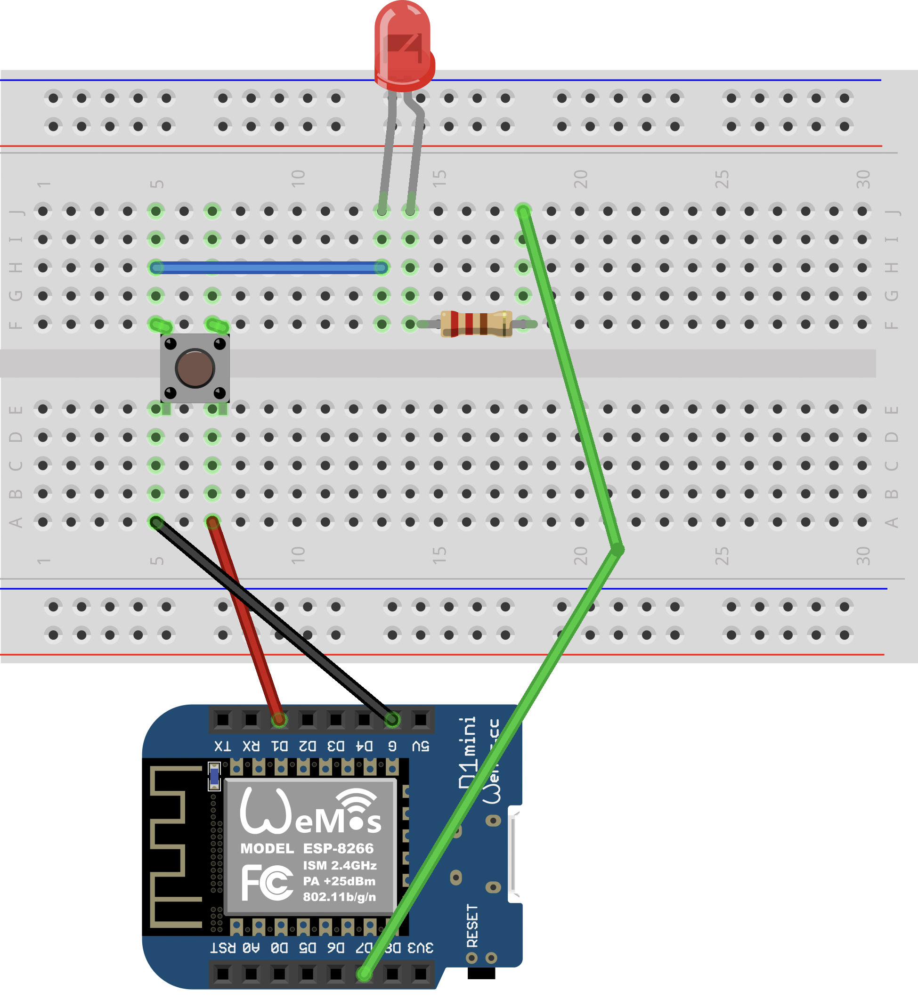

<link rel="stylesheet" href="assets/css/custom.css?v=2">

<div class="nav-container">
  <a href="Grundlagen3" class="button">Zurück</a>
  <a href="Grundlagen5" class="button">Weiter</a>
</div>

## Grundlagen 4 – Button und LED verbinden ▶️ ➕ 💡

**In diesem Kapitel lernst du, wie du den Button mit einer LED verbindest.**

Die LED soll leuchten, solange du den Button gedrückt hältst. Damit das funktioniert, müssen wir zunächst ein neues Konzept verstehen: **Bedingungen**. Mit `if` (wenn) kannst du dem Arduino sagen:

> *Wenn eine Bedingung stimmt, mache etwas.*  
> *Sonst mache etwas anderes.*

**Beispiel:**

```cpp
if (hier die Bedingung) {
  // Das passiert, wenn die Bedingung stimmt
}
else {
  // Das passiert, wenn sie nicht stimmt
}
```

In unserem Fall ist die Bedingung, ob der Button gedrückt ist.

---

<div class="aufgabe">
<h3>🛠️ Erste kleine Aufgabe: Status ausgeben</h3>
<ol>
  <li>Verwende den Aufbau aus <strong>Grundlagen 3</strong>.</li>
  <li>Lade folgenden Code auf den Arduino hoch:
  
<pre class="no-bg"><code>#define BUTTON_PIN D1

void setup()
{
  Serial.begin(9600);
  pinMode(BUTTON_PIN, INPUT_PULLUP);
}

void loop()
{
  byte buttonState = digitalRead(BUTTON_PIN);
  
  if (buttonState == LOW) {
      Serial.println("Button is pressed");
  }
  else {
      Serial.println("Button is not pressed");
  }
  delay(100);
}
</code></pre>
  </li>
  <li>Öffne den Serial Monitor. Drücke den Button und schaue, ob sich der Text ändert.</li>
</ol>
</div>

<div class="merkbox">
💡 Wenn du <code>INPUT_PULLUP</code> nutzt, bedeutet das:<br>
Nicht gedrückt = <code>HIGH</code> (1)<br>
Gedrückt = <code>LOW</code> (0)
</div>

---

<p align="center">
  
</p>

---

<div class="aufgabe">
<h3>🛠️ Aufgabe: LED mit dem Button steuern</h3>
<ol>
  <li>Baue die Schaltung aus dem Schaltplan nach.
    <ul>
      <li>Ein Pin des Buttons wird mit GND verbunden.</li>
      <li>Der andere Pin geht an D1.</li>
      <li>Die LED wird mit einem Vorwiderstand an D7 angeschlossen.</li>
      <li>Achte darauf, dass das lange Bein der LED an D7 angeschlossen ist.</li>
    </ul>
  </li>
  <li>Schreibe deinen eigenen Code, der folgendes tut:
    <ul>
      <li>Den Status des Buttons lesen.</li>
      <li>Mit <code>if</code> prüfen, ob der Button gedrückt ist.</li>
      <li>Die LED einschalten, solange der Button gedrückt ist.</li>
      <li>Die LED ausschalten, wenn der Button nicht gedrückt ist.</li>
    </ul>
  </li>
  <li>Teste deine Schaltung. Drücke den Button – die LED sollte leuchten, solange du ihn gedrückt hältst.</li>
</ol>
</div>

<details>
<summary>💡 Tipp anzeigen</summary>
<p><em>Falls du nicht weiterweißt, schaue dir den Code aus <strong>Grundlagen 3</strong> (Button lesen) und den Code aus <strong>Grundlagen 2</strong> (LED blinken) an und kombiniere beide Ideen.</em></p>
</details>

---

<div class="aufgabe">
<h3>✨ Bonusaufgabe für ganz Schnelle</h3>
<p>Kannst du den Button so programmieren, dass die LED bei jedem Drücken umschaltet?</p>
<ul>
  <li>Beim ersten Druck geht die LED an.</li>
  <li>Beim zweiten Druck geht sie aus.</li>
  <li>Beim dritten Druck wieder an.</li>
  <li>Und so weiter.</li>
</ul>
</div>

<div class="merkbox">
💡 Tipp: Du brauchst folgende Komponenten:
<ul>
  <li>Eine Variable, die speichert, ob die LED gerade an oder aus ist.</li>
  <li>Eine Abfrage, ob der Button <strong>neu gedrückt wurde</strong> (also vom Zustand HIGH auf LOW gewechselt ist).</li>
  <li>Ein Umschalten mit <code>digitalWrite</code> und <code>!</code> (Ausrufezeichen).</li>
</ul>
</div>

<p class="spacing-2">&nbsp;</p>

---

<div class="nav-container">
  <a href="Grundlagen3" class="button">Zurück</a>
  <a href="Grundlagen5" class="button">Weiter</a>
</div>
