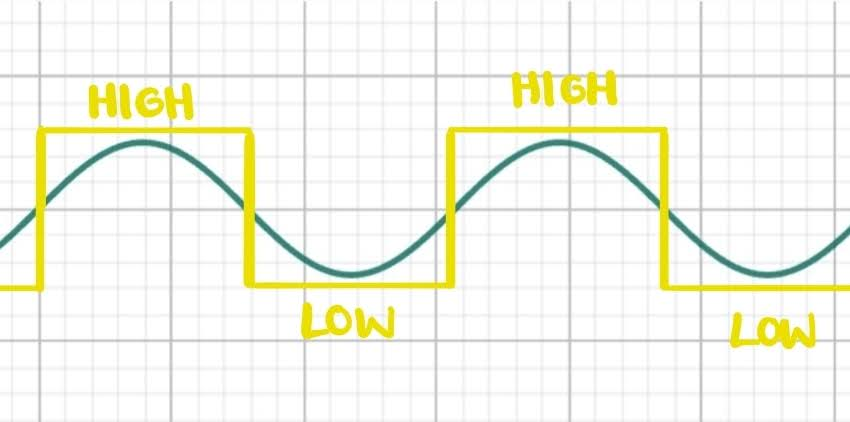

## Grundlagen 5 - Ton erzeugen 🎶

[Zurück zur Kapitelübersicht](Kapiteluebersicht)

**In diesem Kapitel lernst Du, wie man mit einem Piezo-Summer einen Ton spielen kann.** 

Wir hören einen Ton, wenn eine Schallwelle auf das Trommelfell in unseren Ohren trifft. Diese Schallwelle hat eine bestimmte *Amplitude*. Die Amplitude gibt die Höhe bzw. Tiefe der Wellenberge bzw. Wellentäler an und hängt mit der Lautsärke des Tons zusammen. 

Wellenfunktionen sind außerdem periodische Funktionen. Das heißt, dass ein bestimmter Funktionswert in gleichbleibenden Abständen wieder auftaucht. Die *sinus*-Funktion hat zum Beispiel die Periode 2 $\pi$, weil sin(0) = sin(0 + 2 $\pi$) = sin(0 + 2 $\pi$ + 2 $\pi$) ist. Die *Periodendauer T* gibt an, wie viel Zeit das Durchlaufen einer Periode in Anspruch nimmt. 

Einer Schallwelle kann man außerdem eine *Frequenz f* zuordnen. Diese gibt an, wie viele Perioden pro Sekunde durchlaufen werden und lässt sich wie folgt berechnen: *f* = 1/T. Die Frequenz mit der Tonhöhe zusammen, also zum Beispiel damit, ob wir ein **c** oder ein **d** hören. Die Einheit der Frequenz ist Hertz, was mit Hz abgekürzt wird, und so viel wie *pro Sekunde* bedeutet.

Um Töne abzuspielen, nutzen wir einen **Piezo-Summer**. In diesem ist ein Piezo-Kristall verbaut. Der Piezo-Kristall dehnt sich aus, wenn wir eine Spannung anlegen, und kehrt in seinen ursprünglichen Zustand zurück, wenn wir die Spannung wieder wegnehmen. Um nun einen Ton einer bestimmten Frequenz zu erzeugen, schalten wir die Spannung in einem bestimmten Takt ein und wieder aus. Das darfst Du nun einmal selbst ausprobieren.

<p align="left"></p>

## 🛠️ Aufgabe: Kammerton a erzeugen

Wir wollen zunächst den Kammerton **a** erzeugen. 

> *Der Kammerton **a** ist der Ton, der von einem Orchester zu Beginn eines Konzertes von allen Instrumenten zum Einstimmen gespielt wird. Er liegt ungefähr bei 440 Hz.*

1. **Schaltung**:
   Bei Piezo-Summer handelt es sich um ein ungerichtetes elektrisches Bauelement, das heißt, es ist egal, wie rum man ihn anschließt. Ein Anschluss wird mit einem digitalen Pin verbunden, der andere mit dem Gnd-Pin. Baue die Schaltung auf. 
2. **Vorüberlegung**:
   Wir wollen einen Ton mit der Frequenz *f* = 440 Hz abspielen. Dazu müssen wir an den Piezo für eine bestimmte Zeit *t* eine Spannung anlegen und sie anschließend für die Zeit *t* wieder auschalten. Wie groß ist *t*?
> 💡 **Hinweise:**
> - *Welcher Teil der Schallwelle entsteht, wenn die Spannung angelegt wird? Welcher Teil der Welle entsteht, wenn die Spannung ausgeschaltet wird?*
> - *Welche Bedeutung hat die Zeit *2t* für die Welle? Welcher oben engeführten Größe entspricht sie?*

Wenn Du nicht weiter kommst, frag uns gerne. Zur Überprüfung Deiner Lösung kannst Du hier schauen:
<details><summary>Lösung</summary> Die Phase, in der die Spannung angelegt wird entspricht einem Wellenberg, die Phase in der die Spannung abgeschaltet ist einem Wellental. Die Zeit, die, beim Durchlaufen genau eines Wellenberges und eines WEllentals vergeht ist die Periodendauer T. Die Zeit t ist somit die Hälfte der Periodendauer. Also f = 1/T <--> T = 1/f und somit t = T/2 = 1/2f. </details>
  
3. **Code**:
   Jetzt wollen wir ein Programm schreiben, dass den Kammerton a erzeugt. 
   1. Erstelle eine Variable vom Datentyp ``int`` , in der die berechnete Zeit *t* gespeichert ist.
   1. Piezo-Pin ansteuern
       - Muss der digitale Pin, an den der Piezo angeschlossen ist im INPUT- oder im OUTPUT-Modus betrieben werden?
       - Mit welcher Dir schon bekannten Funktion kann man digitale Pins ein oder ausschalten?
       - Bisher haben wir die Dauer, die ein Pin an oder aus sein soll mit der ``delay()``-Funktion festgelegt. Wenn wir ``delay(100)`` schreiben, wartet der Microcontroller 100 Millisekunden, bis er in die nächste Code-Zeile springt. Die von Dir berechnete Zeit *t* liegt im unteren Millisekunden-Bereich. In diesem Bereich ist die einfache ``delay()``-Funktion zu ungenau. Nutze daher die Funktion ``delayMicroseconds()``, in der die Eingabe als Microsekunden interpretiert werden. 
   
> *Falls Du Dir bei den Fragen unsicher bist, frag gerne nach oder schau in die vorherigen Grundlagen-Abschnitte!* 

## 🛠️ Aufgabe: Überprüfung des Klangs

Tatsächlich ist in der Arduino IDE bereits eine Funktion hinterlegt, die genau das macht, was Du gerade selbst geschrieben hast. Das ist die sogenannte ``tone()``-Funktion.

```cpp
// Spielt den Ton mit der Frequenz 440 auf dem am digtalen Pin 3 amgeschlossenen Piezo-Summer
tone(3,440);
```

Schreibe nun Dein Programm aus der vorherigen Aufgabe so um, dass Du anstelle des An- und Ausmachens des digitalen Pins die ``tone()``-Funktion nutzt, um den Kammerton a zu erzeugen. Hört sich beides gleich an oder hörst Du einen Unterschied?

## ✨ Bonusaufgabe für ganz Schnelle

**Baue einen Button ein, der den Piezo-Summer anschalten kann.**

Das Geräusch, das der Piezo-Summer macht, ist nicht unbedingt besonders schön. Daher ist es praktisch, den Piezo nur dann spielen zu lassen, wenn ein Button gedrückt wird, um Euch und Eure Mitmenschen zu schonen.

> 💡 *Tipp: Orientiere dich an dem Code, den Du in Grundlagen 4 geschrieben hast!*


[Weiter zu Grundlagen 6](Grundlagen6) \| [Zurück zur Kapitelübersicht](Kapiteluebersicht)


