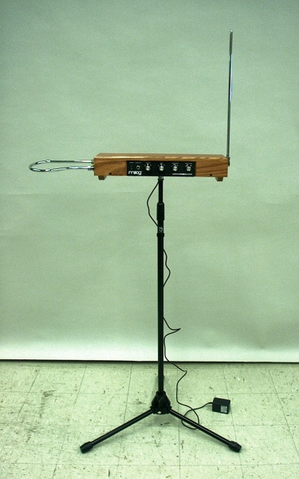

# Theremino 
###  Baue dein eigenes Musikinstrument mit einem Arduino

Willkommen im Kurs! Heute werdet Ihr lernen, wie man ein sogenanntes Theremin mit Hilfe eines Arduinos selber bauen kann. Und ganz nebenbei lernt Ihr außerdem die Grundlagen des Programmierens :)
</img>
Ein Theremin ist ein Instrument, das berührungslos gespielt wird. Anders als bei Instrumenten, die Euch wahrscheinlich geläufiger sind, muss man beim Theremin keine Taste drücken oder Saiten zupfen, sondern einfach die Hand in die Nähe des Instruments halten. Welcher Ton gespielt wird, hängt davon ab, wie weit entfernt die Hand zum Instrument ist. In seiner ursprünglichen Form basiert das Prinzip des Theremins darauf, dass die Hand, je nachdem wie weit entfernt, ein elektrisches Feld mehr oder weniger beeinflusst. Wir wollen ein anderes Prinzip nutzen: Die Messung des Abstands zu Eurer Hand mit Hilfe eines Ultraschallsensors.

In diesem Kurs findet ihr folgende Inhalte: 
1. <a href="https://github.com/eg-lab/ThereminoKurs/blob/main/Grundlagen1.md"> Grundlagen 1 - Kennlernen des Arduinos </a>
2. <a href="https://github.com/eg-lab/ThereminoKurs/blob/main/Grundlagen2.md"> Grundlagen 2 - LED anschließen </a>
3. <a href="https://github.com/eg-lab/ThereminoKurs/blob/main/Grundlagen3.md"> Grundlagen 3 - Button anschließen </a>
4. <a href="https://github.com/eg-lab/ThereminoKurs/blob/main/Grundlagen4.md"> Grundlagen 4 - Button und LED verbinden </a>
5. <a href="https://github.com/eg-lab/ThereminoKurs/blob/main/Grundlagen5.md"> Grundlagen 5 - Ton erzeugen </a>
6. <a href="https://github.com/eg-lab/ThereminoKurs/blob/main/Grundlagen6.md"> Grundlagen 6 - Eine Melodie spielen </a>
7. <a href="https://github.com/eg-lab/ThereminoKurs/blob/main/Sensoren1.md"> Sensoren 1 - Ultraschallsensor anschließen </a>
8. <a href="https://github.com/eg-lab/ThereminoKurs/blob/main/Sensoren2.md"> Sensoren 2 - Phototransistor anschließen (OPTIONAL) </a>
9. <a href="https://github.com/eg-lab/ThereminoKurs/blob/main/Theremin.md"> Theremin bauen </a>

[Zur Übersicht der Kapitel](Kapiteluebersicht)
