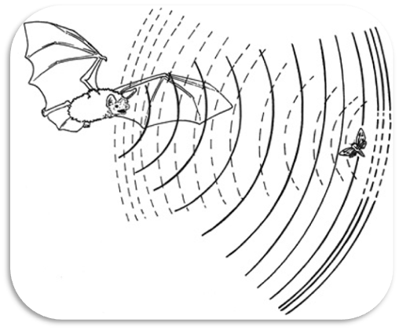
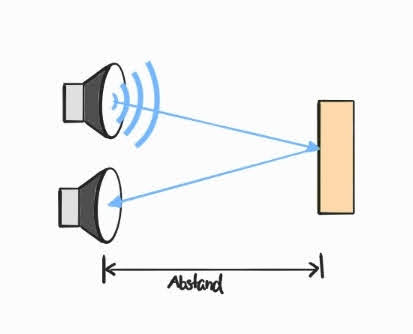
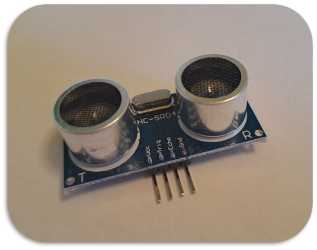

<link rel="stylesheet" href="assets/css/custom.css?v=2">

<div class="nav-container">
  <a href="Grundlagen6" class="button">Zurück</a>
  <a href="Sensoren2" class="button">Weiter</a>
</div>

## Sensoren 1 – Ultraschallsensor anschließen 🔊

**In diesem Kapitel lernst Du, wie man mit einem Ultraschallsensor Abstände messen kann.**

Sensoren sind ganz allgemein elektronische Bauteile, die ihre Umgebung wahrnehmen und Informationen an den Microcontroller weitergeben. Einen Sensor hast Du schon kennengelernt: den Button. Auch er sammelt eine Information (*wurde er gedrückt oder nicht?*) und gibt sie an den Arduino weiter.

Das Auslesen von Sensor-Daten funktioniert häufig über einen `read`-Befehl. Es gibt zwei verschiedene Versionen:

```cpp
analogRead(Pin);   // liefert Werte von 0 bis 1023 (analoge Pins)
digitalRead(Pin);  // liefert nur 0 oder 1 (digitale Pins)
```

---

### Funktionsprinzip

Ein Ultraschallsensor ist ein Sensor, mit dem sich Abstände bestimmen lassen. Das Prinzip, auf dem er beruht, ist das selbe mit dem Fledermäuse ihre Umgebung wahrnehmen.

<p align="center">
  
</p>

Sowohl die Fledermaus als auch ein Ultraschallsensor senden eine Schallwelle aus, die im Ultrachschall-Bereich liegt. Ein Mensch kann solche Schallwellen nicht mehr wahrnehmen, weil die Frequenz zu hoch für unsere Ohren ist. Trifft die Ultraschallwelle auf ein Hindernis (z. B. eine Wand), so wird sie reflektiert. Ein Teil der Welle kommt wieder beim Sender an. Je weiter das Objekt entfernt ist, desto mehr Zeit vergeht.

<p align="center">
  
</p>

Die Schallgeschwindigkeit ist *c<sub>S</sub>*. Kennt man die Zeit *t*, kann man die Länge *l* berechnen:

<p align="center">l = c<sub>S</sub> · t</p>

Da die Welle Hin- und Rückweg braucht:

<p align="center">l = c<sub>S</sub> · (t<sub>mess</sub> / 2)</p>

---

### Anschlüsse des Sensors

Der Ultraschallsensor hat 4 Pins:

- **VCC** → an den 5V-Pin des Arduinos  
- **GND** → an den GND-Pin des Arduinos  
- **TRIG** → an einen digitalen Pin (Signal aussenden)  
- **ECHO** → an einen digitalen Pin (Signal empfangen)

<p align="center">
  
</p>

---

### Die Funktion `pulseIn()`

Um den Ultraschallsensor anzusteuern, brauchen wir eine neue Funktion: **`pulseIn(pin, value)`**  

- `pin` → der Pin, an dem der Arduino den Puls einliest (hier: Echo-Pin)  
- `value` → HIGH oder LOW  

Die Funktion wartet darauf, dass der Pin auf den gewünschten Wert wechselt (bei uns: HIGH).  
Dann misst sie, wie lange der Pin in diesem Zustand bleibt, bis er wieder auf LOW fällt.  
Das Ergebnis ist die gemessene Zeit in **Mikrosekunden**.

---

<div class="aufgabe">
<h3>🛠️ Aufgabe</h3>
<ol>
  <li>Schließe den Ultraschallsensor nach dem Schaltplan an Deinen Arduino an.</li>
  <li>Kopiere den folgenden Code in einen neuen Sketch in der Arduino IDE.</li>
  <li>Schreibe in <code>void loop()</code> Code, der die Distanz berechnet und im seriellen Monitor ausgibt.</li>
</ol>
</div>

### Schaltplan

<div class="schaltplan-box">
  
</div>

### Code

```cpp
// Festlegung der digitalen Pins für Trig & Echo
#define triggerPin 3
#define echoPin 4

// Speichern der Schallgeschwindigtkeit in Konstante in der Einheit Meter pro Micorsekunde
#define schall 0.0343

// Deklaration von Variablen zum Speichern ...
float duration; // ... der Zeit die bis zum wieder Ankommen des Signals vergangen ist und ...
float distance; // ... der Länge, die wir berechnen wollen.


void setup() {
  // Starten des seriellen Monitors
  Serial.begin(9600);

  // Festlegen der Pin-Modi
  pinMode(triggerPin, OUTPUT);
  pinMode(echoPin,INPUT);
  
}

void loop() {
  // Aussenden des Ultraschall-Signals über den Trigger-Pin
  digitalWrite(triggerPin,HIGH);
  delayMicroseconds(10);
  digitalWrite(triggerPin,LOW);

  // Messung der Zeit zwischen Absenden und Empfangen des Signals
  duration = pulseIn(echoPin,HIGH);
  
  // Hier kommt Dein Code hin
  
  delay(1000); // Kurzes Warten, damit der Sensor nicht überfordert wird
}
```

<div class="merkbox">
💡 Hinweis: In <code>pulseIn()</code> steckt bereits ein <code>read()</code>-Befehl. Deshalb brauchst Du hier kein extra <code>digitalRead()</code>.
</div>

---

Nun hast Du alle Grundlagen, die Du brauchst, um ein Theremin zu bauen.  
Wenn Du Lust hast, kannst Du gleich damit starten. Oder Du schaust Dir im optionalen Kapitel **Sensoren 2** an, wie man einen Phototransistor anschließt und in Dein Projekt integriert.

<p class="spacing-1">&nbsp;</p>

---

<div class="nav-container">
  <a href="Grundlagen6" class="button">Zurück</a>
  <a href="Sensoren2" class="button">Weiter</a>
</div>
