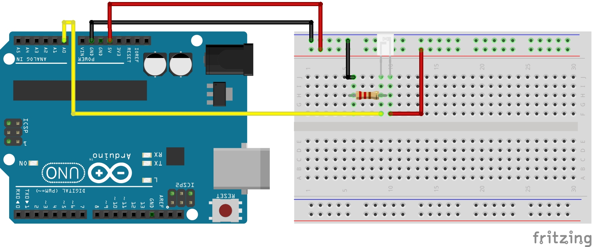

<link rel="stylesheet" href="assets/css/custom.css?v=2">

<div class="nav-container">
  <a href="Sensoren1" class="button">Zurück</a>
  <a href="Theremin" class="button">Weiter</a>
</div>

## Sensoren 2 - Phototransistor anschließen (OPTIONAL)

Und für die ganz Schnellen, wenn ihr Lust habt euch noch mit einem weiteren Bauteil auseinanderzusetzen, schauen wir uns jetzt noch einen **Phototransistor** an.

Es gibt verschiedene Arten von Transistoren, wie zum Beispiel **Bipolartransistoren** oder **MOSFETs**. Wir werden hier nicht weiter darauf eingehen was das genau ist, aber wir werden einen Bipolartransistor verwenden.
Einen Transistor könnt ihr euch allgemein wie eine Art **Schalter oder Verstärker für Strom** vorstellen. Er hat normalerweise **3 Anschlüsse**. Beim Bipolartransistor den **Emitter**, die **Basis** und den **Kollektor**. Die Idee ist, dass zwischen Emitter und Kollektor **nur dann ein Strom fließt, wenn auch in die Basis ein gewisser Strom fließt**, ansonsten nicht, weiterhin wird **mit steigendem Strom an der Basis auch der Strom zwischen Emitter und Kollektor verstärkt**.

In unserem Fall wollen wir uns speziell mit **Phototransistoren** auseinandersetzen. Diese haben keinen klassischen Basisanschluss sondern **funktionieren durch Lichteinfall**. Zwischen Emitter und Kollektor liegt eine Spannung an. Diese reicht zunächst nicht aus um einen Strom durch das Transistormaterial zu erzeugen. Das Material ist aber so beschaffen, dass **bei Beleuchtung Ladungsträger im Inneren erzeugt werden**, die dafür sorgen, dass ein **Stromfluss möglich** ist. **Stärkere Beleuchtung bedeutet mehr Stromfluss und eine höhere Spannung am Ausgang**. Diese kann man über einen analogen Arduino Pin messen.

Ein Phototransistor ermöglich uns also ein **Spannung abhängig von der Lichtintensität zu messen**. Dies wollen wir nun nutzen, um unser Theremin noch ein wenig zu erweitern. Ihr habt ja bereits einen Sensor über einen analogen Pin angeschlossen. Der Phototransitor funktioniert ähnlich.

<div class="aufgabe">
<h3>🛠️ Aufgabe</h3>
<ol>
  <li>Baue die Schaltung zum Anschließen des Phototransistors entsprechend der Abbildung nach</li>
  <li>Lasse dir die gemessenen Werte wie beim Ultraschallsensor auf dem seriellen Monitor ausgeben</li>
</ol>
</div>

### Schaltplan

<div class="schaltplan-box">
  
</div>

Bei unserem Theremin haben wir es bisher geschafft abhängig von dem Abstand von unserer Hand zum Ultraschallsensor unterschiedliche Töne zu spielen. Den Phototransistor wollen wir jetzt nutzen, um **abhängig von der Lichtintensität festzulegen, in welcher Oktave wir uns befinden**.

<div class="aufgabe">
<h3>🛠️ Aufgabe</h3>
<ol>
  <li>In welchem Bereich liegen die gemessenen Werte?</li>
  <li>Finde eine passende Zuweisung von Oktaven basierend auf dem gemessenen Lichteinfall</li>
  <li>Erweitere deinen Theremincode um eine Bestimmung der Okatve</li>
</ol>
</div>

#### Hilfestellung

Als kleine Hilfe könnt Ihr diese Struktur in euren Code einbinden.

Hierbei handelt es sich um ein **2-dimensionales Array**. Also ein Array aus Arrays. Es enthält die **Frequenzen jeder Note (auch Halbtöne) einer Oktave über 6 Oktaven**. Ihr könnt dieses Array nutzen, um **basierend auf dem Ton, den ihr spielen wollt und der Oktave, die ihr bestimmt habt die richtige Frequenz zu ermitteln**. Der Zugriff auf den jeweiligen Wert funktioniert fast so wie bei regulären Arrays.

```cpp
tonMatrix[2][0];
```

Hierbei steht in den **ersten** eckigen Klammern [ ] **aus welcher Oktave** von 0 bis 5 Ihr einen Ton spielen möchtet. In den **zweiten** eckigen Klammern [ ] steht **der Ton, den Ihr spielen möchtet**. Die Töne beginnen mit C beim Index 0, über C# bei 1, D bei 2, und so weiter bis zu H beim Index 11.
Im Code Beispiel würde man also die Frequenz von einem C der zweiten Oktave erhalten.

> - 💡 **Hinweis:**
> -*Einbinden solltest Du den Code am besten außerhalb von Setup und Loop direkt unter deinen Pin Definitionen*

<p class="spacing-1">&nbsp;</p>

---

<div class="nav-container">
  <a href="Sensoren1" class="button">Zurück</a>
  <a href="Theremin" class="button">Weiter</a>
</div>
