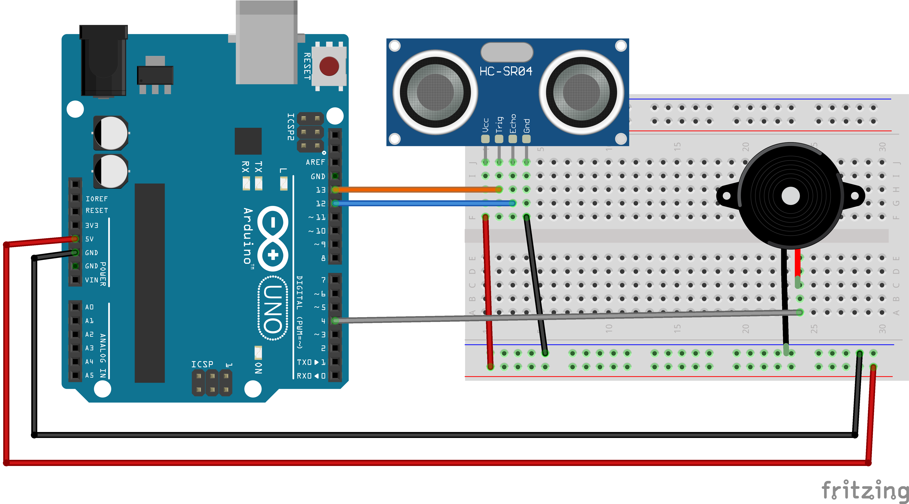
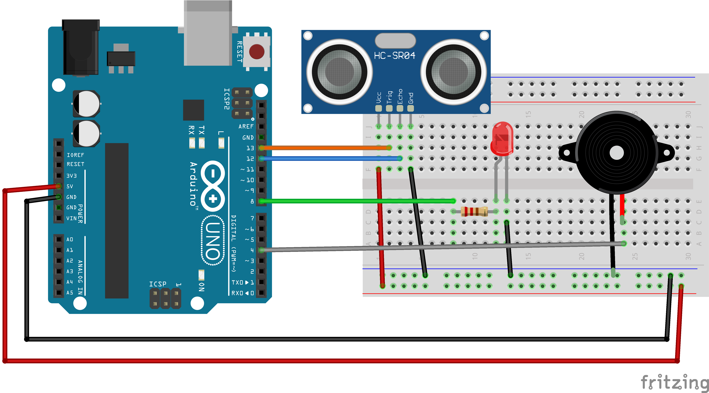

<link rel="stylesheet" href="assets/css/custom.css?v=2">

  <a href="Sensoren2" class="button">Zurück</a>
  <a href="Abschluss" class="button">Weiter</a>

## Projekt – Dein eigenes Theremin 🎶✨

**Jetzt wird es kreativ! Du kombinierst alles, was Du bisher gelernt hast, und baust dein eigenes Instrument.**

Bei einem herkömmlichen Theremin werden Töne erzeugt, wenn Du deine Hand bewegst. Du kannst den Ultraschallsensor verwenden, damit sich der Ton je nach Abstand verändert. Zusätzlich kannst Du weitere Elemente einbauen: LEDs, Taster, Phototransistoren – alles, was dir einfällt.  
Dein Ziel ist es, ein eigenes, einzigartiges Musikinstrument zu erfinden und zu programmieren.

💡 Erinnerung an die Sicherheit: Zieh vor dem Umstecken von Kabeln immer den USB-Stecker ab, damit nichts kaputtgeht.

---

### Schaltplan-Beispiele

Hier findest Du einige Schaltpläne als Anregung. Du musst sie nicht genau nachbauen. Wenn Du eine eigene Idee hast, kannst Du sie auch kombinieren oder abwandeln.  
Wenn Du dir unsicher bist, ob deine Schaltung funktioniert, frag lieber nochmal nach.

  
  
<em>Beispiel: Ultraschallsensor + Piezo für Töne</em>

  
  
<em>Beispiel: Ultraschallsensor + LED, die je nach Abstand leuchtet</em>

<!-- Optional weitere Beispiele:

  
  
<em>Beispiel: Zusätzlich ein Taster zum Umschalten</em>

  
  
<em>Beispiel: Phototransistor für ein weiteres Steuersignal</em>

-->

---

<h3>🛠️ Aufgabe: Erfinde dein eigenes Instrument</h3>
<ol>
  <li>Überlege dir, wie dein Instrument funktionieren soll:
    <ul>
      <li>Soll der Ton je nach Abstand steigen oder fallen?</li>
      <li>Sollen LEDs je nach Entfernung blinken oder die Farbe wechseln?</li>
      <li>Soll ein Taster den Ton an- oder ausschalten?</li>
    </ul>
  </li>
  <li>Wähle eine Schaltung aus und baue sie auf deinem Breadboard auf.</li>
  <li>Schreibe deinen eigenen Sketch in der Arduino IDE – nutze alle Bausteine, die Du kennst:
    <ul>
      <li><code>tone()</code> und <code>noTone()</code></li>
      <li><code>digitalWrite()</code> und <code>analogRead()</code></li>
      <li><code>if</code>-Bedingungen</li>
      <li>Variablen und vielleicht sogar Schleifen</li>
    </ul>
  </li>
  <li>Teste dein Instrument – verbessere es, bis es genau so funktioniert, wie Du es dir vorstellst.</li>
</ol>

💡 Tipp anzeigen

Falls Du nicht weißt, wo Du anfangen sollst: Starte mit dem Theremin-Code aus dem letzten Kapitel.  
Teste erst nur den Ton. Wenn das funktioniert, füge Schritt für Schritt LEDs oder andere Sensoren hinzu.

---

## ✨ Präsentation & Konzert

Stellt euer Instrument der Gruppe vor. Erklärt, wie ihr es gebaut habt, und zeigt live, wie es funktioniert.  
Wer mag, kann ein kleines Konzert spielen oder ein lustiges Geräusch vorstellen.

&nbsp;

---

  <a href="Sensoren2" class="button">Zurück</a>
  <a href="Abschluss" class="button">Weiter</a>

