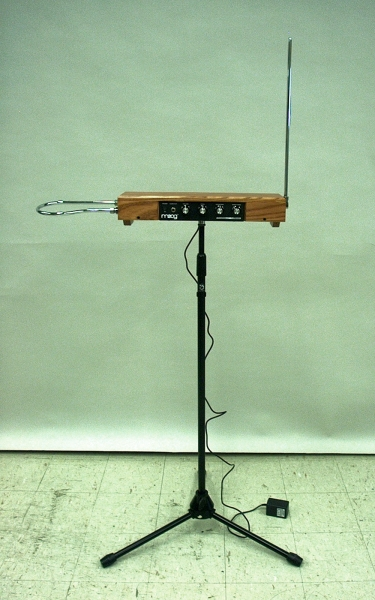

<link rel="stylesheet" href="assets/css/custom.css?v=2">

##  Baue dein eigenes Musikinstrument mit einem Arduino!

Willkommen im Kurs! Heute werdet Ihr lernen, wie man ein sogenanntes Theremin mit Hilfe eines Arduinos selber bauen kann. Und ganz nebenbei lernt Ihr außerdem die Grundlagen des Programmierens.

  

Ein Theremin ist ein Instrument, das berührungslos gespielt wird. Anders als bei Instrumenten, die Euch wahrscheinlich geläufiger sind, muss man beim Theremin keine Taste drücken oder Saiten zupfen, sondern einfach die Hand in die Nähe des Instruments halten. Welcher Ton gespielt wird, hängt davon ab, wie weit entfernt die Hand zum Instrument ist. In seiner ursprünglichen Form basiert das Prinzip des Theremins darauf, dass die Hand, je nachdem wie weit entfernt, ein elektrisches Feld mehr oder weniger beeinflusst. Wir wollen ein anderes Prinzip nutzen: Die Messung des Abstands zu Eurer Hand mit Hilfe eines Ultraschallsensors.

---

## So funktioniert dieser Kurs

In diesem Kurs findest du alle Informationen, Aufgaben und Beispiele, die du brauchst, um Schritt für Schritt dein eigenes Theremin zu bauen.

Du kannst dich mit den **Zurück**- und **Weiter**-Buttons am oberen und unteren Rand jeder Seite durch die Kapitel bewegen:

  <a href="index" class="button">Zurück</a>
  <a href="index" class="button">Weiter</a>

Wenn du auf die große Überschrift **ThereminoKurs** oben auf der Seite klickst, kommst du jederzeit wieder zur Startseite mit der Kapitelübersicht.

- **Aufgaben** stehen immer in solchen Boxen:

  

  <h3>🛠️ Aufgabe</h3>
  <ol>
    <li>Schaltung nachbauen</li>
    <li>Code hochladen</li>
  </ol>
  

  Lies dir jede Aufgabe sorgfältig durch und gehe Schritt für Schritt vor.

- **Bonusaufgaben** sind extra Aufgaben für alle, die besonders schnell fertig sind. In einem kurzen Workshop oder Schnupperkurs kannst du sie einfach ignorieren.

- **Merkboxen** heben wichtige Informationen hervor:

  

  So sehen Merkboxen aus.
  

- **Tipps und Zusatzinfos**

  Manche Abschnitte enthalten Zusatzwissen, das nicht unbedingt nötig ist, um die Aufgaben zu lösen. Solche Inhalte sind hinter einem ausklappbaren Bereich versteckt, den du auf Wunsch öffnen kannst:

  

  
ℹ️ Ich will's genauer wissen

  

  Hier findest du zusätzliche Hintergrundinfos.
  

  

  Tipps und Hilfestellungen, die dir beim Lösen einer Aufgabe helfen, findest du ebenfalls zum Aufklappen. Öffne diese Tipps nur, wenn du nicht weiterkommst:

  

  
💡 Tipp anzeigen

  

  Hier steht ein Tipp, der dir weiterhilft.
  

  

---

## Sicherheit und Hilfestellung

Bevor du eine Schaltung zum ersten Mal mit Strom versorgst, überprüfe sie **mindestens zweimal sorgfältig**. Achte darauf, dass alle Kabel richtig stecken, nichts vertauscht ist und keine Bauteile falsch herum angeschlossen sind. So vermeidest du Kurzschlüsse oder beschädigte Bauteile.

Ganz wichtig: **Immer die Stromzufuhr (USB-Kabel) vom Arduino abziehen**, bevor du etwas an der Schaltung umsteckst oder neue Bauteile einbaust.

Wenn du nicht weiterweißt oder etwas nicht funktioniert, **frage unbedingt nach Hilfe**.

Viel Spaß beim Experimentieren und Programmieren!

---

## Kapitelübersicht

### Grundlagen

- [Grundlagen 1 – Kennlernen des Arduinos](Grundlagen1)
- [Grundlagen 2 – LED anschließen](Grundlagen2)
- [Grundlagen 3 – Button anschließen](Grundlagen3)
- [Grundlagen 4 – Button und LED verbinden](Grundlagen4)
- [Grundlagen 5 – Ton erzeugen](Grundlagen5)
- [Grundlagen 6 – Eine Melodie spielen](Grundlagen6)

### Sensoren

- [Sensoren 1 – Ultraschallsensor anschließen](Sensoren1)
- [Sensoren 2 – Phototransistor anschließen (BONUS)](Sensoren2)

### Projekt

- [Theremin bauen](Theremin)

---

  <a href="https://www.starcode.de/" class="button">Wer wir sind</a>
  <a href="Grundlagen1" class="button">Kurs starten</a>

